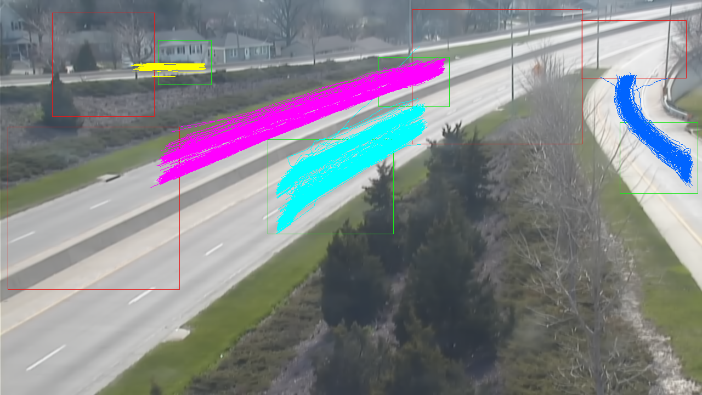

# LBT-count


*Vehicle Turning-Movement Counting using Localization-based Tracking* (LBT-count) is a fast algorithm for performing counts at intersections and along roadways. The core innovation of this algorithm is to crop existing objects from a frame and only pass these regions through a CNN for localization. A few source regions are also processed by the CNN at each frame to initialize new objects. 

## Contents
- `_fov_config/` - .config files containing parameter settings for each unique camera field of view
- `_fov_annotations/` - csv files containing relevant regions (sources, sinks, and ignored regions) for each unique camera field of view
- `_config/` - other config files (Kalman filter parameters and localizer state dict)
- `_readme_ims/` - example images used in this repository
- `_output/` - default output directory for any files generated when code runs
- `util/` - implementations for FrameLoader, Kalman Filter, video output writer, etc.
- `model/` - [Pytorch implementation of Retinanet](https://github.com/yhenon/pytorch-retinanet), modified for multi-gpu running
- `lbt_count.py` - contains code for Vehicle Turning-Movement Counting using Localization-based Tracking
- `lbt_count_draw.py` - modified version of lbt_count.py for plotting vehicle turning movements
- `annotate_frame.py` - cv2-based GUI for annotating camera fields of view
- `count_all.py` - main file, runs lbt_count on all video sequences within an input directory
- `environment.yml` - use this to create a virtual env for this repository if using `conda`
- `requirements.txt` - use this to create a virtual env for this repository if using `pip`

## Requirements
- Python 3 ( Python 3.6 or later is best)
- CUDA 10.2 ( if you have CUDA 11, simply reinstall `pytorch` after step 2 below using: ```pip3 install torch==1.8.1+cu111 torchvision==0.9.1+cu111 -f https://download.pytorch.org/whl/torch_stable.html```

## Instructions to run
1. Clone this repository:
```
git clone https://github.com/DerekGloudemans/LBT-count.git
```

2a. If using pip:

```
cd <path to LBT-count>
python -m venv <path to LBT-count>
source <path to LBT-count>/bin/activate
pip install -r requirements.txt
```

Then, any time you open a new terminal and cd to the repo, you can reactivate the virtual environment with:

```
source <path to LBT-count>/bin/activate
```

Strangely enough the non-conda environment runs about 25% faster than the `conda` environment with the same packages, so we recommend you use the `venv/pip` installation above. That being said, if you prefer `conda`:

2b. Use `conda` instead:

```
cd <path to LBT-count>
conda env create -f environment.yml
conda activate lbt-count
```

3. Download [localizer state dict](https://github.com/DerekGloudemans/LBT-count/releases/download/v0.2/localizer_retrain_112.pt) (should be called "localizer_retrain_112.pt") into the `_config/` folder

4. Run count_all.py
```
python count_all.py <path>
```
where `<path>` is the path to directory containing .mp4 video files to be processed

Additional optional arguments:
- `-gpu`   - int specifying GPU index if you have more than one GPU
- `-range` - specify a 1-indexed integer range of video sequences (i.e. 1-10) within the overall directory to process (useful for splitting task between multiple GPUs)
- `--v`    - print status updates (i.e. current frame and fps, current camera sequence). Also diverts count outputs to a separate file
- `--show` - plot each frame as vehicles are tracked and counted (significantly slows computation)
- `--draw`  - code outputs an image of the camera field of view with every counted vehicle's trajectory overlaid as shown below.

Thus, the following example call:

```
python count_all.py -gpu 1 -range 2-4 --show
```

executes on the machine's 1-index gpu, starts on sequence 2 (the second sequence since AI City Challenge sequence numbering is 1-indexed), computes up to but not including sequence 4, and shows each frame using OpenCV as it is processed.

## Instructions to annotate frames
By default, field of view annotations for all cameras from the 2021 AI City Challenge are included. If you want to add additional camera FOVs, you can annotate a frame from the video with source,sink, and ignore regions using:

```
python annotate_frame.py <path>
```
where `<path>` is the path to the directory containing example frames from the cameras you'd like to annotate.


